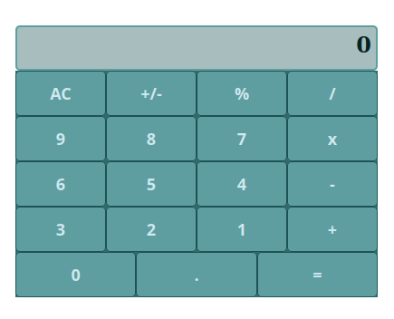

# React Calculator

This project was bootstrapped with [Create React App](https://github.com/facebook/create-react-app).

## Built With

- Javascript
- React

## Live Version

[React Calculator](https://calculator-magic.herokuapp.com/)

## Getting Started

To run a local copy follow the steps below:

### Prerequisites 

 - **Nodejs** v.10 at least installed.

### Setup

- Clone this repo by with the following commands in your terminal:
`git clone git@github.com:thneves/React-Calculator.git`

- Then go to project folder using:
`cd React-Calculator`

- Open it in your code editor

## Available Scripts

In the project directory, you can run:

### `npm start`

Runs the app in the development mode.\
Open [http://localhost:3000](http://localhost:3000) to view it in the browser.

The page will reload if you make edits.\
You will also see any lint errors in the console.

## Author

👤 **Thales Neves**

- GitHub: [@thneves](https://github.com/thneves)
- Twitter: [@tsneves11](https://twitter.com/tsneves11)
- LinkedIn: [Thales Neves](https://www.linkedin.com/in/thales-neves10/)

## Show your support

Give a ⭐️ if you like this project!

